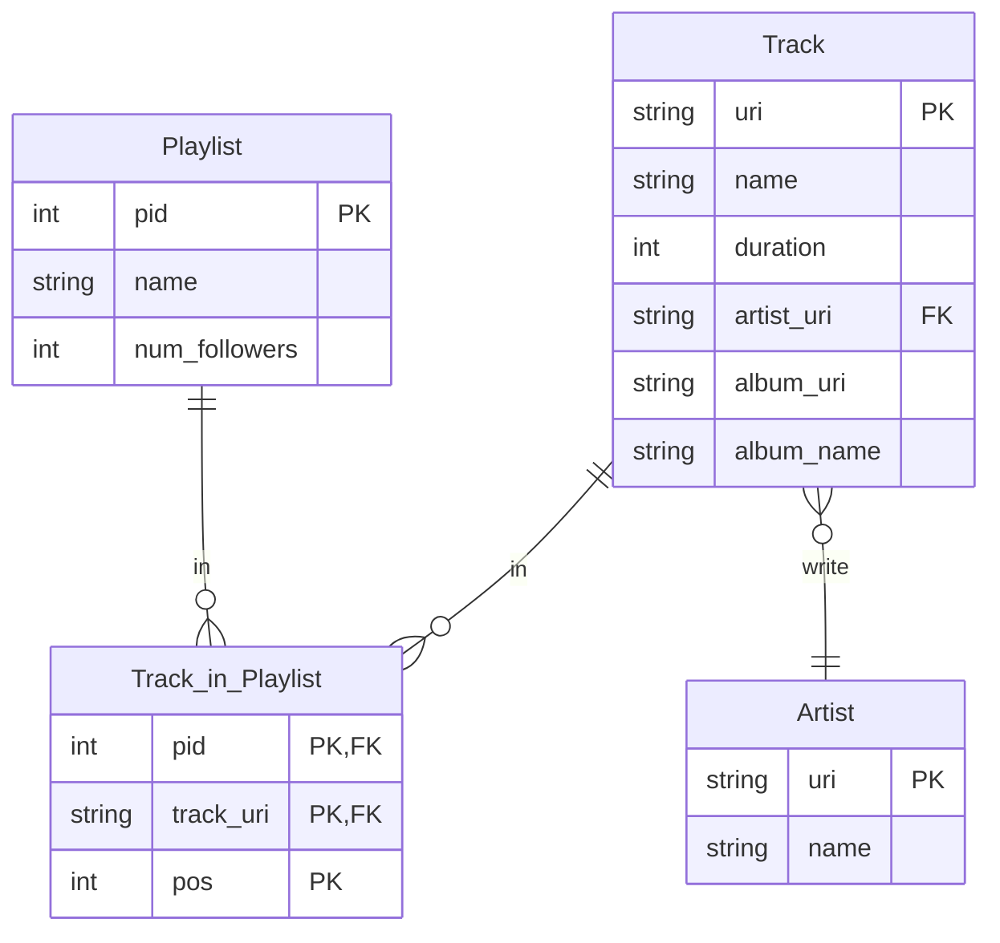

# Big data Project @ UniBo a.y. 2023/2024

## Project Description

The project is based on [Spotify Million Playlist Dataset Challenge](https://www.aicrowd.com/challenges/spotify-million-playlist-dataset-challenge).

## Preprocessing

### Normalization and JSON to CSV

The first step of the preprocessing is to normalize the `JSON` files and convert them to `CSV` files. The normalization is done by `preprocessing.ipynb` that takes as input the JSON files and outputs the normalized CSV files.

In addition many properties are discarded during the process.

This is the *E/R* schema of the dataset:

