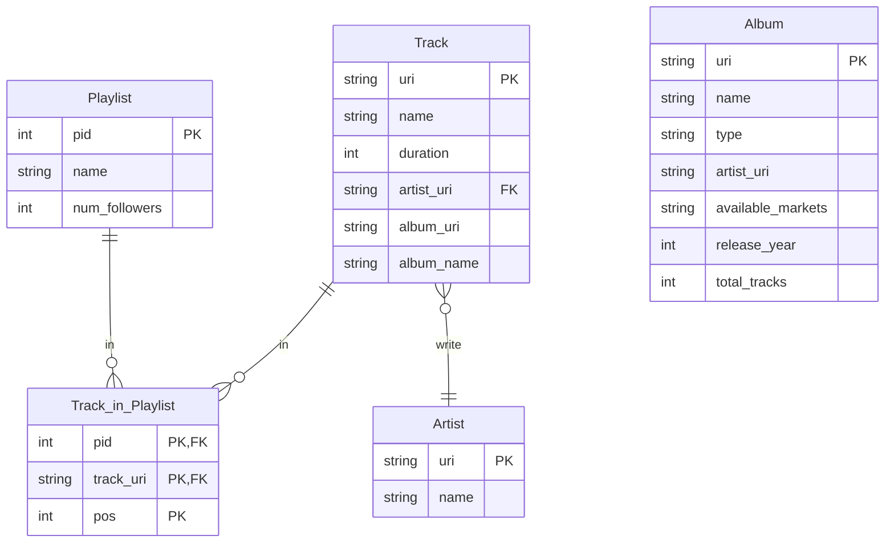

# Big data Project @ UniBo a.y. 2023/2024

## Project Description

The project is based on [Spotify Million Playlist Dataset Challenge](https://www.aicrowd.com/challenges/spotify-million-playlist-dataset-challenge).

## Preprocessing

### Normalization & Converting JSON to CSV

The first step of the preprocessing is to normalize the `JSON` files and convert them to `CSV` files. The normalization is done by `preprocessing.ipynb` that takes as input the JSON files and outputs the normalized CSV files.

In addition many properties are discarded during the process.

This is the *E/R* schema of the dataset:

### Data Augmentation

The initial dataset has been augmented by relying on the `Spotify Web API`. In particular:

- **Track**: Each track has been enriched with the following columns: 
    - *Explicit*: it can be True or False indicating wether the lyrics contains explicit content or not.
    - *Artists*: a list of `|` separated uri's of the artists that authored the track.
    - *Available_markets*: a list of `|` separated markets in which the track is available.
    - *Popularity*: a value between 0 and 100 representing the popularity of the track.

- **Artist**: We then enriched information regarding each artist by storing in the `artist.csv` file, as well as the name and relative artist's uri, also the following columns:
    - *Followers*: number of followers of the artist.
    - *Genres*: a list of `|` separated genres performed by the artist. 
    - *Popularity*: a value between 0 and 100 representing popularity of the artist.
    With respect to the initial dataset the list of artist have been extended to include not only the main artist of a track, but also all the artist featuring in that track.

- **Album**: The album csv table (`albums.csv`) has been entirely generated by querying the API starting from the referenced available on the tracks. We selected the following columns:
    - *uri*: the uri of the album. 
    - *type*: the type of album: It can be *album*, *single*, *compilation*.
    - *artists*: a list of `|` separated uri's of the artists that authored the album.
    - *available_markets*:  a list of `|` separated markets in which the album is available.
    - *name*: the name of the album.
    - *release_year*: the year in which the album was released.
    - *total_tracks*: the number of tracks that the album contains.

- **Features**: For each track we queried the Spotify Api in order to obtain its relative audio features. These features include:
    - *key*: the tracks key. It ranges from `-1` to `11`, following the standard (Pitch Class notation)[https://en.wikipedia.org/wiki/Pitch_class] (-1 indicates that no key has been detected). 
    - *loudness*: typically ranges from -60 and 0 db. Indicates the overall loudness of a track in decibels. 
    - *tempo*: estimated tempo of a track in beats per minuted (BPM).
    - *mode*: indicated the modality of a track (1 is *major* while 0 is *minor*). 
    - *danceability*: indicates how suitable a track is for dancing. Ranges from 0.0 to 1.0.
    - *valence*: measures the musical positiveness conveyed by a track. Ranges from 0.0 to 1.0. 
    - *instrumentalness*: a prediction on presence of vocals in the track. Ranges from  0.0 to 1.0. Values above 0.5 are intended to represent instrumental tracks.
    - *liveness*: detects the presence of an audience in the recording. Ranges from 0.0 to 1.0. A value above 0.8 provide strong likelihood that the track is live.
    - *acousticness*: a measure of how much the track is acoustic. Ranges from 0.0 to 1.0.
    - *energy*: measures the perceptual intensity and activity of a track. Ranges from 0.0 to 1.0. 
    - *speechiness*: Detectes the presence of spoken words. Values from 0.0 to 0.33 most likely represent music. Values from 0.33 and 0.66 indicates that the track may contain both music and speech. Values above 0.66 describe tracks that are probably made entirely of spoken words.

- **Playlists**: In order to have more data to work on we generated new playlists, in particular 1 000 000. So we have in total 2M playlists. We selected the tracks to put in each playlist from the tracks we already had.    

Given the fact that some `Spotify URI` have changed during the time since when the initial dataset was conceived, we cut off some data that is not available anymore.

### The final dataset

**Total size**: `~10G`

- **Track**: `~981M`
- **Playlist**: `~59M`
- **Track_in_Playlist**: `~8,6G`
- **Artist**: `~27M`
- **Album**: `~289M`
- **Features**: `~214M`

## Exploratory queries

## Main Jobs

### Manuel Andruccioli

### Kelvin Olaiya
